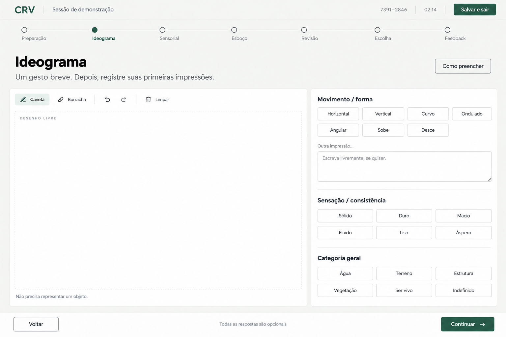
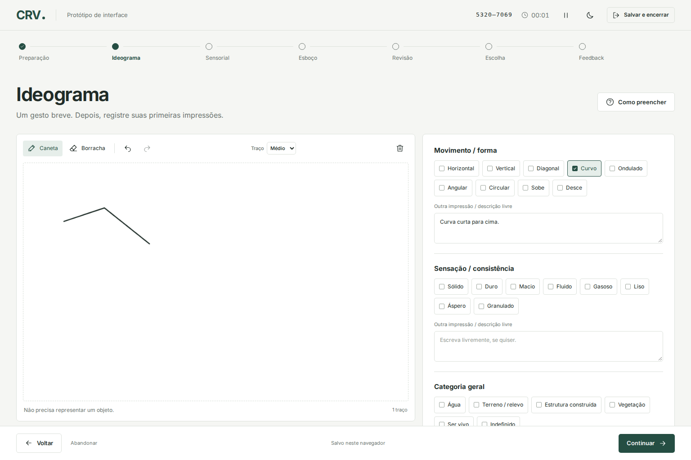
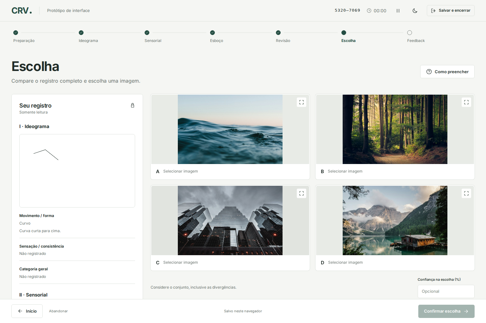
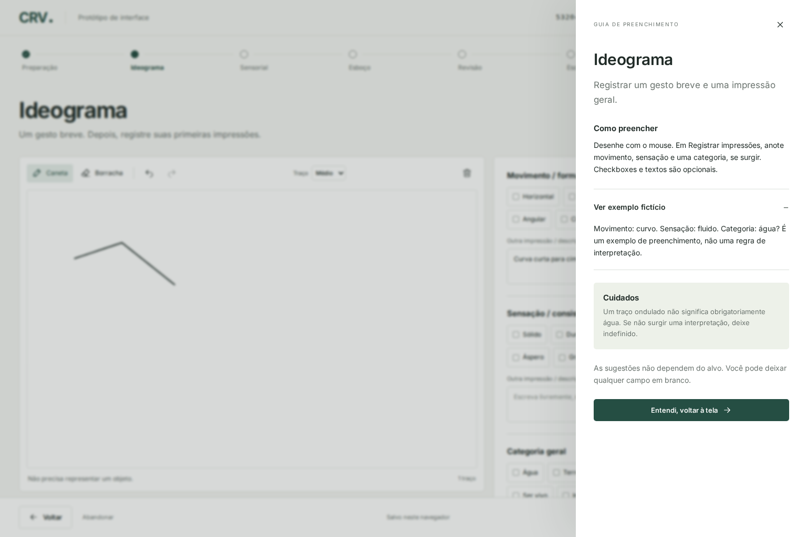

# CRV Go

Aplicativo desktop local e 100% offline para conduzir, registrar e validar sessões estruturadas de **Visualização Remota Coordenada** (*Coordinate Remote Viewing* — CRV), cobrindo as Etapas I a III do protocolo.

O CRV Go implementa um protocolo rigoroso de **duplo-cego (*double-blind*)**: o alvo é sorteado criptograficamente no backend antes do início da coleta, o registro perceptual original é bloqueado de forma imutável antes da exibição das opções, e o praticante realiza uma escolha forçada entre 4 alternativas fotográficas neutras antes de receber o gabarito.



---

## Sumário

- [O que é o CRV Go?](#o-que-é-o-crv-go)
- [A Metodologia e o Fluxo da Sessão](#a-metodologia-e-o-fluxo-da-sessão)
  - [1. Preparação](#1-preparação)
  - [2. Etapa I — Ideograma e Gestalt Primordial](#2-etapa-i--ideograma-e-gestalt-primordial)
  - [3. Etapa II — Percepções Sensoriais](#3-etapa-ii--percepções-sensoriais)
  - [4. Etapa III — Esboço e Relações Espaciais](#4-etapa-iii--esboço-e-relações-espaciais)
  - [5. Revisão e Destaques](#5-revisão-e-destaques)
  - [6. Bloqueio Rígido (*Lock*)](#6-bloqueio-rígido-lock)
  - [7. Escolha Cega (1 de 4)](#7-escolha-cega-1-de-4)
  - [8. Revelação e Feedback](#8-revelação-e-feedback)
- [Recursos Principais](#recursos-principais)
- [Arquitetura e Segurança](#arquitetura-e-segurança)
- [Como Usar (Distribuição Pré-compilada)](#como-usar-distribuição-pré-compilada)
- [Desenvolvimento e Compilação](#desenvolvimento-e-compilação)
- [Créditos e Acervo de Imagens](#créditos-e-acervo-de-imagens)
- [Licença](#licença)

---

## O que é o CRV Go?

O CRV Go foi projetado para praticantes, estudantes e pesquisadores que buscam uma ferramenta ergonômica, privativa e metodologicamente sólida para sessões de CRV.

### Filosofia e Rigor Científico
- **Sem promessas paranormais ou avaliações mágicas**: O aplicativo não tenta interpretar seus desenhos por inteligência artificial nem emitir julgamentos subjetivos. Ele atua como um caderno de campo digital neutro e um avaliador objetivo de escolha forçada.
- **Isolamento de viés (*Blinding*)**: Evita a contaminação analítica e o viés de confirmação retroativo garantindo que o praticante nunca tenha pistas do alvo real durante o registro.
- **Privacidade total**: Nenhum dado é enviado para a nuvem. O aplicativo funciona completamente desconectado da internet, persistindo histórico e preferências localmente no computador do usuário.

---

## A Metodologia e o Fluxo da Sessão

O protocolo segue uma progressão estruturada da percepção sensorial mais primitiva e rápida até impressões espaciais e a análise final:

```
[Preparação] ➔ [Etapa I: Ideograma] ➔ [Etapa II: Sensações] ➔ [Etapa III: Esboço]
                                                                     │
[Feedback & Gabarito] 🠔 [Escolha 1 de 4] 🠔 [Bloqueio Imutável] 🠔 [Revisão]
```

### 1. Preparação
Antes de iniciar, o usuário pode registrar opcionalmente seu nível de disposição física e foco mental. O sistema confirma a disponibilidade dos alvos do acervo (192 imagens elegíveis) e apresenta um tempo de referência recomendado (10 minutos), sem cronômetros punitivos.

### 2. Etapa I — Ideograma e Gestalt Primordial
Captura a resposta neuromuscular inicial espontânea gerada pelo estímulo da coordenada do alvo:
- **Canvas 2D interativo**: Ferramentas de caneta com espessura variável, borracha por traço completo e histórico de desfazer/refazer.
- **Atributos de Movimento e Forma**: Traços rápidos, curvos, retos, angulares, ascendentes, descendentes.
- **Consistência e Gestalt**: Sólido, líquido, pastoso, gasoso; natural, artificial, estrutura, água, relevo.
- **AOL (*Analytical Overlay*)**: Campo dedicado para descarregar e registrar suposições conscientes da mente analítica (ex.: *"parece a Torre Eiffel"*), evitando que interfiram nas impressões perceptuais brutas.



### 3. Etapa II — Percepções Sensoriais
Registro sistemático de qualidades físicas que alcançam a percepção consciente, com seleções rápidas opcionais e campo de texto livre:
- **Cores e Luminosidade**: Cores predominantes, claro, escuro, reflexivo, contrastante.
- **Texturas**: Áspero, liso, granulado, pontiagudo, irregular.
- **Temperatura e Umidade**: Quente, frio, seco, úmido, gelado, morno.
- **Sons, Odores e Gostos**: Grupo expansível para dados acústicos, químicos e gustativos.
- **AOLs da Etapa II**: Área de descarte analítico específica para sensações.

### 4. Etapa III — Esboço e Relações Espaciais
Desenvolvimento visual em um canvas de desenho ampliado:
- **Esboço e Croqui**: Representação visual das formas e contornos percebidos.
- **Relações Espaciais e Dimensionais**: Proporções (vertical, horizontal, alto, largo, profundo, circular), posições relativas (acima, abaixo, ao lado, centro) e perspectiva.
- **AOLs da Etapa III**: Registro de ideias de modelos conceituais completos.

### 5. Revisão e Destaques
Visualização consolidada de todas as notas, seleções e desenhos produzidos na sessão:
- **Seleção de Destaques**: Marcação de até 5 impressões consideradas mais marcantes pelo praticante.
- **Nível de Confiança Subjetivo**: Pontuação opcional de 0 a 100% sobre a clareza geral da sessão.

### 6. Bloqueio Rígido (*Lock*)
Ao avançar para a fase de escolha, **o registro original é transacionalmente bloqueado e tornado imutável**. É impossível alterar desenhos ou notas após este ponto. Essa barreira garante integridade científica incontestável e previne que a visualização das alternativas altere a memória do que foi percebido.

### 7. Escolha Cega (1 de 4)
O sistema apresenta 4 imagens aleatórias rotuladas neutramente como opções A, B, C e D:
- Uma dessas opções é o alvo verdadeiro sorteado no início da sessão.
- As outras três são distratores sorteados aleatoriamente do catálogo, sem repetição na mesma sessão.
- O praticante analisa suas próprias anotações (disponíveis em modo somente leitura) contra as 4 fotos, escolhe a imagem mais compatível e registra seu nível de confiança na escolha.



### 8. Revelação e Feedback
A escolha do usuário é gravada com segurança no banco antes que o gabarito seja retornado pelo servidor:
- **Resultado imediato**: Indicação clara de acerto ou erro.
- **Identificação do Alvo**: Exibição da fotografia correta com título, descritivo original e créditos da fonte (Farsight Institute).
- **Comentários Pós-Feedback**: Campo livre para anotações retrospectivas, estudos de acerto ou análise de distratores, gravado separadamente do registro original da sessão.

---

## Recursos Principais

- **100% Local e Privado**: Executa em loopback local (`127.0.0.1`), sem contas, telemetria ou chamadas a servidores externos.
- **Acervo Embutido de 192 Alvos**: Catálogo unificado, testado e desduplicado pronto para uso offline logo no primeiro lançamento, com suporte à importação de catálogos locais customizados em ZIP ou pasta.
- **Histórico e Estatísticas Contínuas**:
  - Consulta e filtragem de sessões passadas por data e estado (concluídas, ativas, abandonadas antes ou depois das opções).
  - Taxa de acerto acumulada comparada objetivamente com a linha de base aleatória de 25% (probabilidade matemática em 4 opções).
  - Gráfico de desempenho cumulativo ao longo do tempo.
- **Exportação para CSV**: Exportação completa do histórico tabulado para planilhas, com proteção contra injeção de fórmulas (*CSV formula injection*).
- **Impressão Nativa (Salvar como PDF)**: Relatórios formatados para impressão profissional nativa do navegador, com diagramação multipáginas inteligente e preservação integral dos desenhos vetoriais e do feedback.
- **Backup e Restauração Segura (ZIP)**: Mecanismo de exportação de backup completo (`crv-backup-v1`) com manifest de integridade SHA-256 e recuperação atômica com rollback automático em caso de interrupção ou arquivo inválido.
- **Design Moderno e Acessível**: Interface responsiva criada com Svelte 5 e Tailwind CSS, tipografia Inter, alternância de tema Claro/Escuro, contraste visual refinado e suporte completo para navegação por teclado e mouse.
- **Ajuda Contextual e Exemplos Fictícios**: Guias detalhados de "Como preencher" em cada etapa com exemplos colapsáveis para não enviesar a sessão atual.



---

## Arquitetura e Segurança

```
┌────────────────────────────────────────────────────────┐
│                        Navegador                       │
│     SPA em Svelte 5 + Tailwind CSS (Vite singlefile)   │
└───────────────────────────▲────────────────────────────┘
                            │ HTTP Loopback (127.0.0.1)
                            │ Token Efêmero + CSRF Header
┌───────────────────────────▼────────────────────────────┐
│                    Servidor Go + Chi                   │
│  - Máquina de estados da sessão                        │
│  - Sorteio criptográfico (crypto/rand)                 │
│  - Servidor de imagens com URLs opacas                 │
│  - Motor de backup/restauração transacional            │
└───────────────────────────▲────────────────────────────┘
                            │ SQL Transactions
┌───────────────────────────▼────────────────────────────┐
│                 SQLite (modernc.org/sqlite)            │
│               Armazenamento local do usuário           │
└────────────────────────────────────────────────────────┘
```

1. **Go + Chi**: Backend compilado de alto desempenho, sem runtime externo.
2. **SQLite em Go Puro**: Utiliza `modernc.org/sqlite` sem necessidade de CGO ou compilador C/gcc.
3. **Frontend Embutido**: Os assets compilados do Svelte são empacotados diretamente no binário do Go (`embed.FS`).
4. **Proteção de Loopback**: A API aceita requisições apenas de `127.0.0.1`, exige token efêmero de bootstrap na URL inicial e valida tokens CSRF em todas as mutações.

---

## Como Usar (Distribuição Pré-compilada)

Não é necessário ter Node.js, Go ou compiladores instalados para executar o aplicativo.

### Windows
1. Baixe ou gere o pacote `crv-go-windows-amd64.tar.gz` e descompacte em uma pasta de sua escolha.
2. Certifique-se de manter a pasta `farsight/` no mesmo diretório do executável `crv.exe`.
3. Dê um duplo clique em `crv.exe`.
4. O navegador padrão abrirá automaticamente com o aplicativo pronto.

### Linux
1. Descompacte o pacote `crv-go-linux-amd64.tar.gz`.
2. Mantenha a pasta `farsight/` ao lado do binário `crv`.
3. Conceda permissão de execução:
   ```sh
   chmod +x crv
   ```
4. Execute:
   ```sh
   ./crv
   ```

### Encerramento Seguro
Para fechar o aplicativo e garantir que todas as transações pendentes no banco sejam concluídas, clique no botão **Salvar e encerrar** no rodapé da aplicação.

---

## Desenvolvimento e Compilação

### Pré-requisitos
- **Go**: versão 1.26 ou superior.
- **Node.js**: versão 24 ou superior (com npm).
- No Windows PowerShell, utilize `npm.cmd` se houver bloqueios de política de execução para scripts `.ps1`.

### Comandos de Construção e Testes

```sh
# Instala dependências do frontend e testes
npm ci

# Verificação estática de tipos (TypeScript + Svelte)
npm run check

# Compila o frontend SPA (Vite singlefile em dist/index.html)
npm run build

# Executa testes unitários e de integração do backend Go
go test ./...
go vet ./...

# Executa testes ponta a ponta (Playwright E2E)
npm run test:e2e

# Gera os pacotes finais distribuíveis (.tar.gz para Windows e Linux)
npm run package
```

### Execução em Modo de Desenvolvimento

Para rodar o servidor local sem abrir o navegador e usando um diretório de dados descartável:

```sh
go run . --data-dir tmp-data/demo --catalog-dir farsight --no-browser
```

O servidor imprimirá no terminal a URL local de inicialização contendo o token de bootstrap efêmero.

---

## Créditos e Acervo de Imagens

- **Catálogo Farsight**: O acervo de imagens em `farsight/` conserva integralmente seus créditos originais: *Farsight Institute / Courtney Brown e fotógrafos de terceiros*, com a menção de uso: *“Local research archive only”*. A inclusão do catálogo no pacote local preserva a proveniência e links de origem, não concedendo direitos adicionais de redistribuição comercial sobre as fotografias.
- **Tipografia Inter**: Criada por Rasmus Andersson e distribuída sob a [SIL Open Font License 1.1](docs/INTER-OFL.txt).
- **Avisos de Terceiros e Dependências**: Consulte [docs/THIRD_PARTY_NOTICES.md](docs/THIRD_PARTY_NOTICES.md) para a lista detalhada de licenças de bibliotecas Go, pacotes npm e hashes SHA-256 das distribuições.

---

## Licença

O código-fonte autoral do **CRV Go** é distribuído sob os termos da **[Licença MIT](LICENSE)**.

```
Copyright (c) 2026 Thiago J. M. (Thiagojm)
```

As fotografias de terceiros contidas no catálogo `farsight/` pertencem aos seus respectivos autores e ao Farsight Institute, mantidas sob seu termo de arquivo local de pesquisa.
